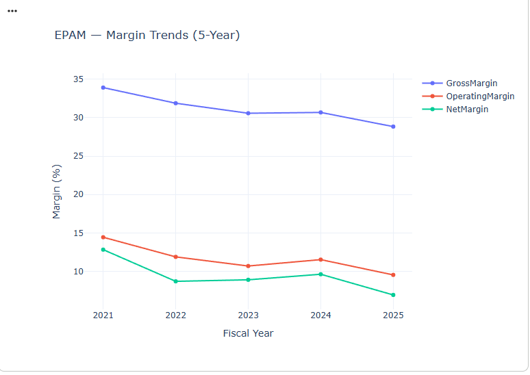
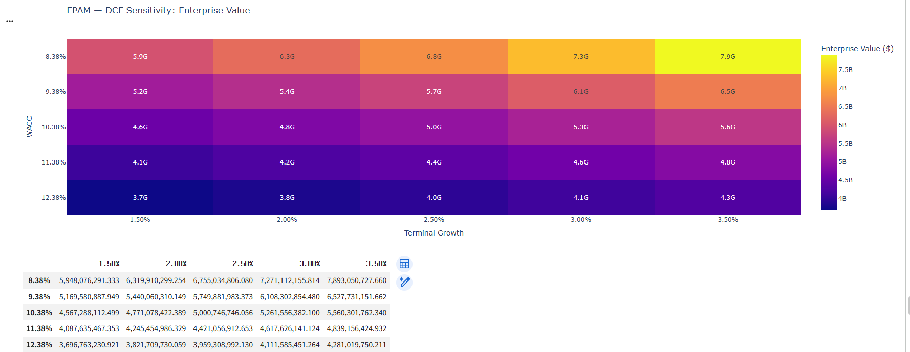

# EPAM--Valuation--Analyzer
Automated SEC EDGAR financial analysis, comps valuation, and DCF pipeline
# Automated Financial Statement & Valuation Analyzer

A Python pipeline that automates the equity research / FP&A valuation workflow: pull 5 years of SEC-filed financials for a target company and its comps, screen financial health, triangulate value via DCF and comps multiples, and auto-generate a valuation report — for any U.S.-listed company, in minutes.

**Why I built this:** During my FP&A externship at Attronica, I manually analyzed 4 years of audited financials, built driver-based projections, and cross-validated a DCF against comparable company multiples for a 4-page investment recommendation. This project generalizes that exact workflow into reusable code.

## What It Does

1. Pulls 5-year financial statements from **SEC EDGAR** (XBRL `companyfacts`) for a target ticker + comps
2. Computes margin/ROE/leverage/liquidity trends
3. Screens financial health via **Altman Z-Score** and **Piotroski F-Score**
4. Builds **comps-based multiples valuation** (EV/EBITDA, EV/Revenue, P/E)
5. Runs a **driver-based DCF** (CAPM-derived WACC, Gordon-growth terminal value)
6. Stress-tests the DCF with a **WACC × terminal-growth sensitivity grid**
7. **Cross-validates** DCF vs. comps and flags wide divergence
8. Auto-generates a markdown valuation report

## Case Study: EPAM Systems

I ran the full pipeline on EPAM (IT services), against comps ACN, CTSH, DXC, and IBM.

### 5-Year Margin Trends

EPAM's operating margin fell from 14.4% to 9.5% over 5 years — a structural trend that directly informed the DCF's margin assumptions rather than assuming a flat continuation of today's margin.

### Financial Health: Altman Z-Score

EPAM scores "Safe" (4.43) alongside ACN and CTSH; DXC stands out as financially distressed (1.13) — corroborated by its outlier P/E multiple below.

### Comps Multiple Distribution

DXC's P/E of 82.85x is flagged "Not Meaningful" (depressed earnings denominator) and excluded specifically from the P/E median, while still included in EV/EBITDA and EV/Revenue — standard sell-side practice for handling multiple outliers.

### DCF Sensitivity: WACC × Terminal Growth

Enterprise value ranges from $3.7B to $7.9B across plausible WACC/growth combinations — illustrating how sensitive DCF outputs are to discount-rate assumptions.

### Cross-Validation: DCF vs. Comps

DCF ($5.0B) and comps ($3.2B–$5.4B) diverge by 44.9% — the pipeline automatically flags this as wide divergence and recommends revisiting assumptions before finalizing a view, rather than silently presenting a single number.

## Tech Stack

`Python` · `pandas` · `numpy` · `requests` · `plotly` · `yfinance` · SEC EDGAR API · FRED (risk-free rate)

## Key Engineering Challenges Solved

- **XBRL tag inconsistency:** Different filers tag the same concept differently (e.g., EPAM switched revenue tags after adopting ASC 606 in 2018; IBM doesn't report a standalone `OperatingIncomeLoss` tag). Built a fallback-and-merge system across candidate tags per line item.
- **Fiscal year unreliability:** SEC's `fy` field can't be trusted for annual filtering since 10-Ks also embed quarterly comparison data — fixed by filtering on actual period duration and indexing by period end date.
- **Balance sheet identity fallbacks:** Some filers (e.g., Accenture) don't tag total `Liabilities` directly — derived it from `Assets − StockholdersEquity` instead.
- **Multiple outlier handling:** DXC's distressed-earnings P/E (82.85x) is excluded specifically from the P/E median rather than dropping the company entirely or letting it distort the EV/EBITDA and EV/Revenue medians.

## Run It Yourself

Open `Finance_Project.ipynb` in Google Colab, set `TARGET_TICKER` and `COMPS_TICKERS` in the config cell, and run all cells. No paid API keys required.

## Sample Output

See [`EPAM_valuation_report.md`](EPAM_valuation_report.md) for the full auto-generated report.
